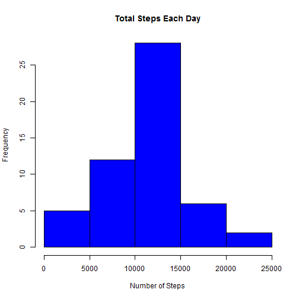
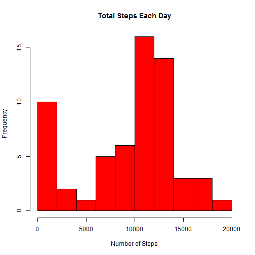

### About
This was the first project for the **Reproducible Research** course in Coursera's Data Science specialization track. The purpose of the project was to answer a series of questions using data collected from a [FitBit](http://en.wikipedia.org/wiki/Fitbit).


## Loading and preprocessing the data
Download, unzip and load data into data frame `data`. 


```r
unzip("activity.zip")
data <- read.csv("activity.csv")
```


## What is mean total number of steps taken per day?

1. Calculate the total number of steps taken per day.

```r
steps_per_day <- aggregate(steps ~ date, data, sum)
```
2. Make a histogram of the total number of steps taken each day.

```r
hist(steps_per_day$steps, main = paste("Total Steps Each Day"), xlab="Number of Steps", col="blue")
```

 
<br />
3. Calculate and report the **mean** and **median total** number of steps taken per day

```r
mean(steps_per_day$steps)
```

```
## [1] 10766.19
```

```r
median(steps_per_day$steps)
```

```
## [1] 10765
```

## What is the average daily activity pattern?
1. Make a time series plot (i.e. `type = "l"`) of the 5-minute
   interval (x-axis) and the average number of steps taken, averaged
   across all days (y-axis)
   

```r
steps_by_interval <- aggregate(steps ~ interval, data, mean)
plot(steps_by_interval$interval,steps_by_interval$steps, type="l", xlab="Interval", ylab="Number of Steps",main="Average Number of Steps per Day by Interval")
```

 

2. Which 5-minute interval, on average across all the days in the
   dataset, contains the maximum number of steps?

```r
steps_by_interval$interval[which.max(steps_by_interval$steps)]
```

```
## [1] 835
```


## Imputing missing values
1. Calculate and report the total number of missing values in the
   dataset (i.e. the total number of rows with `NA`s)

```r
sum(is.na(data$steps))
```

```
## [1] 2304
```

2. Devise a strategy for filling in all of the missing values in the
   dataset. The strategy does not need to be sophisticated. For
   example, you could use the mean/median for that day, or the mean
   for that 5-minute interval, etc.
   Use the means for the 5-minute intervals as fillers for missing values, by:
   
  * merging two datasets by the common column `"interval"`
  * and populating NAs with mans of 5-minunte intervals.

3. Create a new dataset that is equal to the original dataset but with
   the missing data filled in.

```r
new_data <- merge(data, steps_by_interval, by = "interval", suffixes = c("",  "_new"))
NAs <- is.na(data$steps)
new_data$steps[NAs] <- new_data$steps_new[NAs]
new_data <- new_data[, c(1:3)]
```

4. Make a histogram of the total number of steps taken each day and
   Calculate and report the **mean** and **median** total number of
   steps taken per day. Do these values differ from the estimates from
   the first part of the assignment? What is the impact of imputing
   missing data on the estimates of the total daily number of steps?

```r
new_steps_per_day <- aggregate(steps ~ date, new_data, sum)
hist(new_steps_per_day$steps, main = paste("Total Steps Each Day"), xlab="Number of Steps", col="red")
```

 

```r
mean(new_steps_per_day$steps)
```

```
## [1] 9563.93
```

```r
median(new_steps_per_day$steps)
```

```
## [1] 11215.68
```

The impact of the missing data seems rather low, at least when estimating the total number of steps per day.

## Are there differences in activity patterns between weekdays and weekends?
1. Create a new factor variable in the dataset with two levels -- "weekday" and "weekend" indicating whether a given date is a weekday or weekend day.

```r
daytype <- function(date) {
  if (weekdays(as.Date(date)) %in% c("Saturday", "Sunday")) {
    "weekend"
  } else {
    "weekday"
  }
}

new_data$daytype <- as.factor(sapply(new_data$date, daytype))
```
2. Make a panel plot containing a time series plot (i.e. `type = "l"`)
   of the 5-minute interval (x-axis) and the average number of steps
   taken, averaged across all weekday days or weekend days
   (y-axis).

```r
new_steps_by_interval <- aggregate(steps ~ interval + daytype, new_data, mean)

library(lattice)
xyplot(new_steps_by_interval$steps ~ new_steps_by_interval$interval|new_steps_by_interval$daytype, 
       main="Average Steps per Day by Interval",
       xlab="Interval", ylab="Steps",layout=c(1,2), type="l")
```

 
